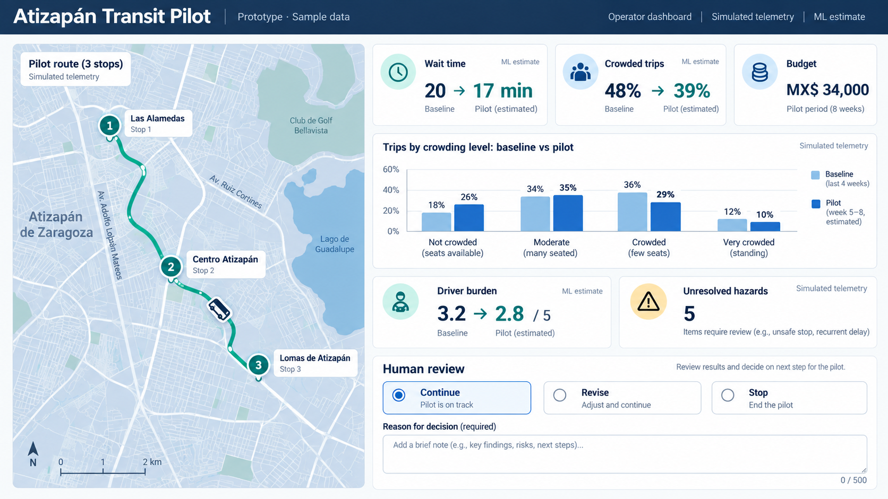
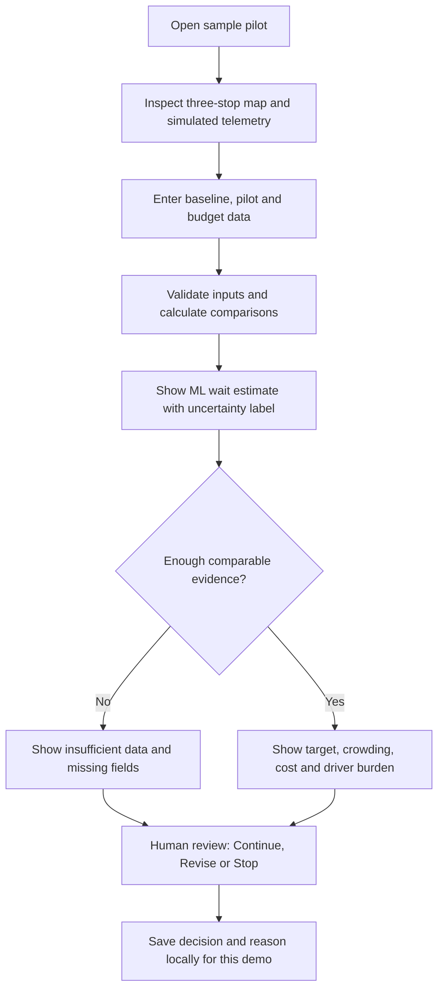
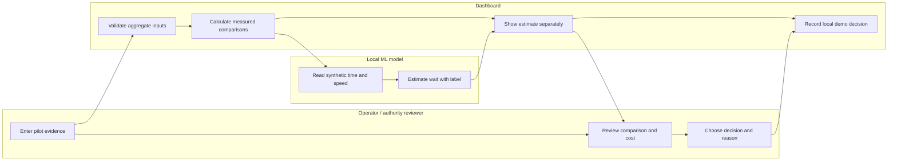

# PACKET — Week 7: Atizapán Transit Pilot

**Valeria Karam · Team 4 · Individual build slice · Draft before code**

## Problem in my words

Passengers on a human-driven colectivo corridor cannot easily tell how long they will wait or whether the next vehicle will be crowded. A new information system is only worth continuing if it measurably helps passengers without imposing an unaffordable cost or unfair burden on drivers. A report of a hazard is not evidence that a crash was prevented.

## Exact user and vacuum

The primary user of this slice is the **operator or transport-authority reviewer** who decides whether a small pilot should continue. The passenger represented in its measurements is Marisol, a frequent colectivo user who cares about waiting and crowding. This is a synthetic persona, not a documented real interview. The proposed setting is **one Atizapán commuter corridor and three stops**. The actual corridor, stops, participating operator, payer and data controller require local confirmation before a real pilot.

The Blueprint declaration for Valeria is a **passenger wait/crowding pilot budget, baseline and go/no-go dashboard**, honoring Condition 2. The dashboard also honors aggregation, human review, voluntary driver participation and the shadow clause.

## Success definition

Before the module closes, a reviewer can open a public demo URL while signed out, see a map of three **simulated** stops and vehicle telemetry, edit baseline and pilot inputs, see correctly calculated wait and crowding comparisons and an itemized budget, then record **Continue / Revise / Stop** with a written reason. A 20-minute baseline and 17-minute pilot must display **15% less waiting**. Missing evidence must show **Insufficient data**, and an ML output must be identified as a simulated estimate, never a measured improvement. The reviewer, not the model, makes the decision.

## Image-generated mockup

This image is a design concept, **not a screenshot of a working product**. Its place names, amounts and timeline are illustrative; the live slice must use the confirmed 14-day baseline plus 30-day pilot, label sample values and avoid implying that a stop pair has been approved.

## Feature flow

## Actors and handoffs

## Benchmark and localization

**Existing benchmark:** Transit shows real-time arrivals and lets riders share crowding reports through GO crowdsourcing ([Transit partner description](https://resources.transitapp.com/article/416-template-content); [crowding explanation](https://blog.transitapp.com/public-transit-riders-are-helping-one-another-avoid-crowds-c929a4fe6c7d/)).

**My difference:** This Atizapán colectivo slice turns aggregated wait/crowding evidence, cost and driver burden into a bounded **human decision about a pilot**, with no individual driver scoring or automatic sanction. It does not claim a better arrival prediction than Transit.

## Three-year view

If the pilot works, the full product could expand to more locally confirmed colectivo corridors and publish comparable, aggregated reliability by route and time. Operators and authorities could fund improvements based on measured passenger benefit, affordable cost and documented case closure. Drivers would retain paid, correctable participation and a veto over any new use of their knowledge, including autonomous-system training.

## Scope cut

This slice does **not** dispatch vehicles, sell rides, collect live passenger location, record passengers continuously, rank individual drivers, impose fares, issue sanctions or prove crash reduction. The MX$2 fare increase and six-month extension are **unapproved scenarios**, not team decisions. The dashboard is a demo with invented aggregate data; a real pilot would require an operator, payer, data controller and verified route.

## Architecture and Dragon Stack

| Layer | Free implementation | What it does | Data boundary |
|---|---|---|---|
| Geodata/maps | Leaflet + OpenStreetMap tiles | Centers on Atizapán and displays three clearly simulated stop markers and a route line | Placeholder coordinates, not an approved route |
| ML | Small local regression model trained on labeled synthetic route/time observations | Estimates next wait from time slot and simulated vehicle speed; shows estimate separately from observed wait | No claim of real-world accuracy |
| Phone telemetry | Simulated GPS coordinates, timestamp and speed from a consenting pilot vehicle | Animates a sample vehicle and feeds the estimate | No hidden or real driver tracking |
| Interface | React, TypeScript and CSS on a free Vercel deployment | Validated inputs, comparisons, budget and human decision | No accounts or personal records |
| Storage | Browser session state only | Keeps edits and decision during the open demo session | No personal database; resets on reload |

**Calculation:** Wait reduction = `(baseline wait - pilot wait) / baseline wait × 100`. A baseline of zero or missing inputs produces “Insufficient data.” Crowding change is shown in percentage points, with sample sizes. Total budget sums itemized costs; cost per observed trip divides by the pilot trip count only when that count is positive.

## Conditions and security floor

- Show baseline (14 days) and pilot (30 days) by route and time window. Expose waits, crowding, breakdowns, verified hazards, response times, unresolved cases, false positives, driver burden and cost, with missing fields honestly marked.
- Display aggregated information only. Conflicting reports and telemetry require human review. No automated dispatch, subsidy or penalty.
- The real pilot would require voluntary paid driver participation, correction rights, limited access and retention, an assigned case owner, independent hazard verifier and authority closure. Unresolved cases remain visible.
- **Shadow clause:** Driver-contributed safety or route knowledge cannot be reused for employment surveillance, insurance/licensing scores or autonomous training without fresh worker approval, payment and an income-protecting transition. Declining a pilot cannot cost a driver a route or job.
- The demo has no API keys or database, stores no personal data, and uses invented examples labeled as such. Every numerical/text input has type, range and length checks. If later versions store personal data, add authentication and row-level access controls before launch.

## Test plan

1. Open the production URL in a signed-out private window on desktop and mobile; no Vercel login wall.
2. Verify the map shows three simulated stops, sample GPS/speed and a visible “Simulated telemetry” label even if tiles fail to load.
3. Enter baseline wait of 20 minutes and pilot wait of 17 minutes: confirm a 15% reduction; change baseline to 0 and confirm “Insufficient data.”
4. Change crowding from 48% to 39%: confirm a 9-percentage-point decrease, not a claim of 9% fewer crashes.
5. Change each budget item: total and cost per trip must update; zero trips must not cause Infinity/NaN.
6. Leave the decision reason blank or enter excessive text: validation must block saving. Select Revise and provide a reason: the chosen human decision must appear.
7. Check that no personal driver data, secret, automatic sanction or approved MX$2 fare is displayed.
8. Record at least one genuine bug, fix it, redeploy and rerun its failing check. Then test the screens in sequence with a fresh synthetic Marisol or operator persona; log the largest confusion, fix it and retest.

## Delivery and session discipline

Minimum **five meaningful commits** and **two production deploys**. The first deploy supports the mechanical test; the second shows the bug fix and persona-driven change. At each work-session close, update `DECISIONS.md` with decisions, open risks and tomorrow’s first move, then commit and push. Submit live URL, GitHub link, 3-minute demo plus 30-second reflection, `PACKET_Valeria.pdf`, `PERSONA_Valeria.pdf` and `BUILDCHAT_Valeria.pdf`.
